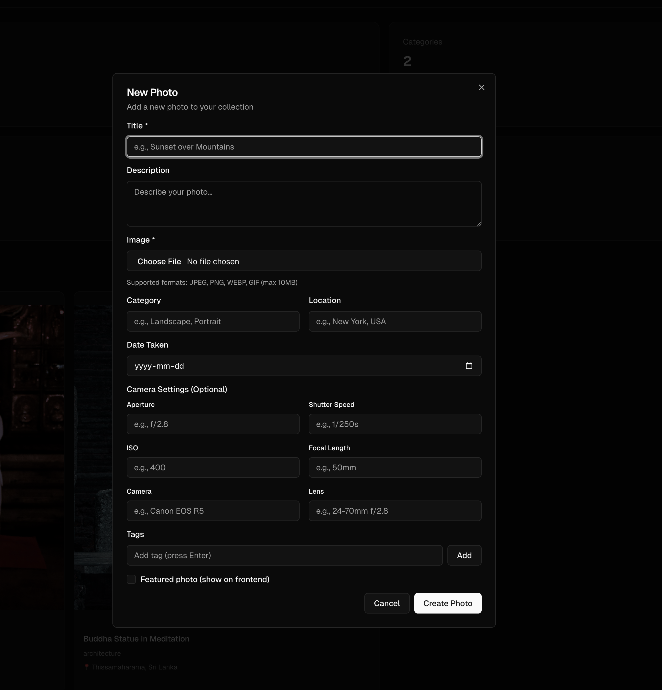
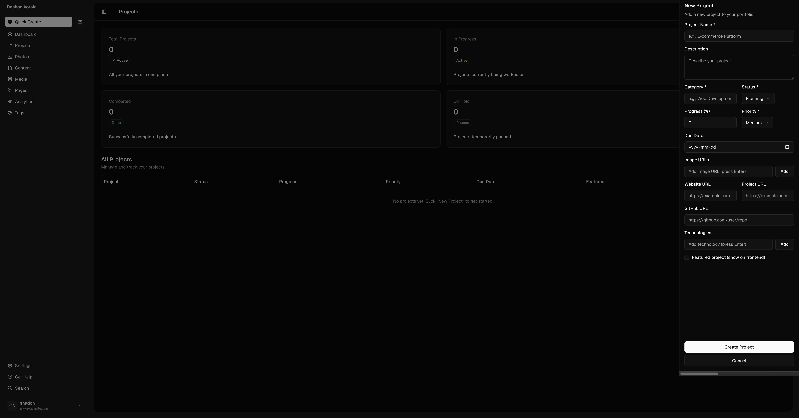

# Personal CMS

A modern, full-featured personal content management system built with Next.js, Supabase, and shadcn/ui. Perfect for managing personal projects, photography portfolios, and content.

## 📸 Preview







## 🚀 Features

### Core Features
- **Authentication**: Secure password-based authentication with Supabase
- **Dashboard**: Overview of all your content and statistics
- **Projects Management**: Track and manage personal projects with:
  - AI-powered project content generation (optional questionnaire flow)
  - Multiple images per project
  - Status tracking (draft, published, archived)
  - Technology tags
  - Featured projects
  - Links (website, GitHub, case study)
  - Problem/solution descriptions
  - Features and roles tracking

- **Photography Management**: Organize your photo collection with:
  - Bulk upload support
  - AI-powered metadata generation (OpenAI integration)
  - Category organization
  - Camera settings tracking
  - Location and date information
  - Tags and featured photos
  - Image preview and optimization

- **Content Management**: Manage various content types
- **Media Library**: Centralized media management
- **Pages**: Create and manage custom pages
- **Analytics**: Track your content performance
- **Tags**: Organize content with tags

### Technical Features
- **Next.js 15** with App Router
- **Supabase** for database and authentication
- **TypeScript** for type safety
- **Tailwind CSS** for styling
- **shadcn/ui** components
- **Server Actions** for data mutations
- **Row Level Security (RLS)** for data protection
- **Responsive Design** - works on all devices
- **Dark Mode** support

## 📋 Prerequisites

Before you begin, ensure you have:

- **Node.js** 18+ installed
- **pnpm** package manager (recommended) or npm/yarn
- A **Supabase** account (free tier works)
- (Optional) An **OpenAI API key** for AI features (photo analysis and project content generation)

## 🛠️ Installation

### 1. Clone the Repository

```bash
git clone <your-repo-url>
cd rashodkorala-cms
```

### 2. Install Dependencies

```bash
pnpm install
```

### 3. Set Up Supabase

1. Create a new project at [Supabase](https://supabase.com/dashboard)
2. Go to **Settings** → **API** to get your credentials
3. Create a `.env.local` file in the root directory:

```env
NEXT_PUBLIC_SUPABASE_URL=your_supabase_project_url
NEXT_PUBLIC_SUPABASE_PUBLISHABLE_KEY=your_supabase_anon_key
OPENAI_API_KEY=your_openai_api_key_optional
```

### 4. Set Up Database

Run the following SQL scripts in your Supabase SQL Editor (in order):

1. **Projects Table**: `database-schema.sql`
2. **Photos Table**: `database-schema-photos.sql`
3. **Add Alt Text** (if needed): `database-migration-add-alt-text.sql`

See the detailed setup guides:
- [Projects Setup Guide](./PROJECTS_SETUP.md)
- [Photos Setup Guide](./PHOTOS_SETUP.md)

### 5. Set Up Storage Buckets

Create storage buckets in Supabase Dashboard → Storage:

1. **photos** bucket (public, for photo uploads)
   - Set up policies as described in [Bulk Upload Setup](./BULK_UPLOAD_SETUP.md)

### 6. Run the Development Server

```bash
pnpm dev
```

Open [http://localhost:3000](http://localhost:3000) in your browser.

## 📚 Documentation

### Setup Guides
- [Projects Setup](./PROJECTS_SETUP.md) - Setting up the projects feature
- [Photos Setup](./PHOTOS_SETUP.md) - Setting up the photography feature
- [Bulk Upload Setup](./BULK_UPLOAD_SETUP.md) - Bulk photo upload with metadata
- [AI Photo Analysis Setup](./AI_PHOTO_ANALYSIS_SETUP.md) - AI-powered metadata generation
- [AI Project Generation Setup](./AI_PROJECT_GENERATION_SETUP.md) - AI-powered project content generation

### Database Schema

The CMS uses the following main tables:

- **projects**: Personal projects with images, status, progress, etc.
- **photos**: Photography collection with metadata, categories, tags

All tables include:
- Row Level Security (RLS) enabled
- User-specific data isolation
- Automatic timestamps (created_at, updated_at)

## 🎯 Usage

### Creating a Project

#### Option 1: AI Questionnaire (Recommended)

1. Navigate to **Projects** in the sidebar
2. Click **New Project**
3. Click **"Use AI Questionnaire (Optional)"** button
4. Answer 5 steps of questions about your project:
   - **Step 1**: Basic information (name, category, description)
   - **Step 2**: Problem & solution
   - **Step 3**: Features & functionality
   - **Step 4**: Technical details
   - **Step 5**: Links & resources
5. Click **"Generate with AI"** - All fields will be automatically filled
6. Review and adjust the generated content
7. Upload images, add any missing details
8. Click **Create Project**

#### Option 2: Manual Entry

1. Navigate to **Projects** in the sidebar
2. Click **New Project**
3. Fill in project details manually:
   - Title, subtitle, category
   - Problem and solution descriptions
   - Features and technology stack
   - Upload multiple images
   - Add links (live URL, GitHub, case study)
   - Add roles
   - Mark as featured
4. (Optional) Use individual AI generation buttons for specific fields
5. Click **Create Project**

### Adding Photos

#### Single Photo Upload

1. Navigate to **Photos** in the sidebar
2. Click **New Photo**
3. Select an image file
4. (Optional) Click **AI Analyze** to auto-fill metadata
5. Review and edit the AI-generated fields
6. Fill in additional details (camera settings, location, etc.)
7. Click **Create Photo**

#### Bulk Upload

1. Navigate to **Photos** in the sidebar
2. Click **Bulk Upload**
3. Upload a metadata JSON file (see [Bulk Upload Setup](./BULK_UPLOAD_SETUP.md))
4. Select matching photo files
5. Review and edit metadata
6. Click **Upload** to process all photos

### AI Features

#### AI Photo Analysis

The CMS includes AI-powered photo analysis using OpenAI's GPT-4 Vision API:

1. Upload a photo
2. Click **AI Analyze**
3. The AI will automatically generate:
   - Title
   - Description
   - Category
   - Location (if identifiable)
   - Tags
   - Alt text

See [AI Photo Analysis Setup](./AI_PHOTO_ANALYSIS_SETUP.md) for configuration.

#### AI Project Content Generation

Generate complete project content using AI:

1. Click **"Use AI Questionnaire"** when creating a new project
2. Answer questions about your project
3. AI generates all content fields:
   - Title and subtitle
   - Problem statement
   - Solution description
   - Features list
   - Technology stack
   - Roles
4. Review and refine the generated content

The AI uses GPT-4o-mini for cost-effective content generation. Individual fields can also be generated separately using the AI buttons next to each field.

## 🏗️ Project Structure

```
├── app/
│   ├── api/              # API routes
│   │   ├── analyze-photo/ # AI photo analysis endpoint
│   │   ├── generate-project-content/ # AI project field generation
│   │   └── generate-project-from-questions/ # AI questionnaire endpoint
│   ├── auth/             # Authentication pages
│   ├── protected/         # Protected routes (CMS)
│   │   ├── dashboard/    # Dashboard page
│   │   ├── projects/     # Projects management
│   │   ├── photos/       # Photography management
│   │   └── ...
│   └── layout.tsx        # Root layout
├── components/
│   ├── photos/           # Photo-related components
│   ├── projects/         # Project-related components
│   │   └── project-questionnaire.tsx # AI questionnaire component
│   └── ui/               # shadcn/ui components
├── lib/
│   ├── actions/          # Server actions
│   ├── supabase/         # Supabase client setup
│   ├── types/            # TypeScript types
│   └── utils/            # Utility functions
├── database-schema*.sql   # Database migration files
└── README.md
```

## 🔒 Security

- **Row Level Security (RLS)**: All database tables have RLS enabled
- **User Isolation**: Users can only access their own data
- **Authentication Required**: All CMS routes are protected
- **Environment Variables**: Sensitive keys stored in `.env.local`
- **No Indexing**: Site is configured to not be indexed by search engines

## 🎨 Customization

### Styling

The project uses Tailwind CSS and shadcn/ui. To customize:

1. Edit `tailwind.config.ts` for theme customization
2. Modify `app/globals.css` for global styles
3. Update component styles in `components/`

### Adding New Features

1. Create database schema (SQL file)
2. Add TypeScript types in `lib/types/`
3. Create server actions in `lib/actions/`
4. Build UI components in `components/`
5. Add routes in `app/protected/`

## 🚀 Deployment

### Deploy to Vercel

1. Push your code to GitHub
2. Import project in [Vercel](https://vercel.com)
3. Add environment variables:
   - `NEXT_PUBLIC_SUPABASE_URL`
   - `NEXT_PUBLIC_SUPABASE_PUBLISHABLE_KEY`
   - `OPENAI_API_KEY` (optional)
4. Deploy!

### Environment Variables

Required:
- `NEXT_PUBLIC_SUPABASE_URL`
- `NEXT_PUBLIC_SUPABASE_PUBLISHABLE_KEY`

Optional:
- `OPENAI_API_KEY` (for AI photo analysis and project content generation)

## 📝 Scripts

```bash
# Development
pnpm dev

# Build for production
pnpm build

# Start production server
pnpm start

# Lint code
pnpm lint
```

## 🤝 Contributing

This is a personal CMS template. Feel free to:

1. Fork the repository
2. Create a feature branch
3. Make your changes
4. Submit a pull request

## 📄 License

This project is open source and available under the [MIT License](LICENSE).

## 🆘 Troubleshooting

### Database Errors

- Ensure RLS policies are set up correctly
- Check that user_id is properly set in all queries
- Verify table schemas match the SQL files

### Storage Errors

- Verify storage buckets exist
- Check bucket policies allow uploads
- Ensure bucket is set to public (for photos)

### AI Features Not Working

- Check OpenAI API key is set in `.env.local`
- Verify you have OpenAI credits
- Check browser console for errors
- For project generation: Ensure GPT-4o-mini access is enabled
- For photo analysis: Ensure GPT-4 Vision access is enabled

### Authentication Issues

- Verify Supabase credentials in `.env.local`
- Check Supabase project is active
- Ensure email confirmation is configured (if required)

## 📚 Resources

- [Next.js Documentation](https://nextjs.org/docs)
- [Supabase Documentation](https://supabase.com/docs)
- [shadcn/ui Documentation](https://ui.shadcn.com)
- [Tailwind CSS Documentation](https://tailwindcss.com/docs)

## 🙏 Acknowledgments

- Built with [Next.js](https://nextjs.org)
- Database and Auth by [Supabase](https://supabase.com)
- UI Components by [shadcn/ui](https://ui.shadcn.com)
- Icons by [Tabler Icons](https://tabler.io/icons)

## 📧 Support

For issues and questions:
1. Check the documentation files in the repository
2. Review the setup guides
3. Open an issue on GitHub

---

**Note**: This CMS is configured to not be indexed by search engines. All pages include `noindex` meta tags and robots.txt disallows all crawlers.
